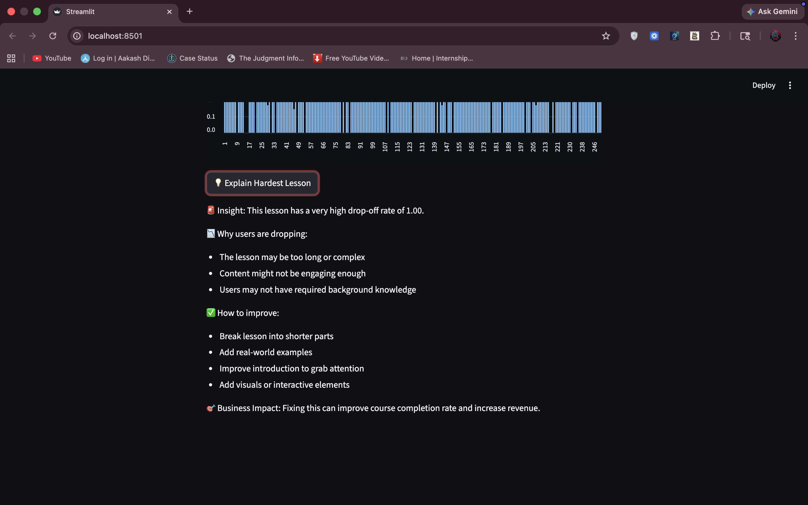

🚀 LearnLog: EdTech Engagement Tracker
📌 Overview

LearnLog is a data analytics project that tracks user engagement on an EdTech platform and identifies lessons where students drop off early.

🛠️ Tech Stack
MySQL (Database)
Python (Data Generation)
SQL (CTEs, Aggregations)
Streamlit (Dashboard)
🔥 Key Features
Tracks user behavior (play, pause, complete)
Identifies hardest lessons using SQL
Interactive dashboard with drop-off visualization
Insight generation for business decisions
📊 Key SQL Concept Used
Common Table Expressions (CTEs)
Aggregation & CASE statements
Behavioral analytics
💡 Business Insight

Lessons with high drop-off rates indicate poor engagement. Improving these lessons can increase course completion, user satisfaction, and platform revenue.

▶️ How to Run
 bash

pip install -r requirements.txt
streamlit run app.py

## 📷 Dashboard Preview

## 📷 Tableau Preview

1[Graph](Screenshot 2026-04-11 at 4.48.44 AM.png)