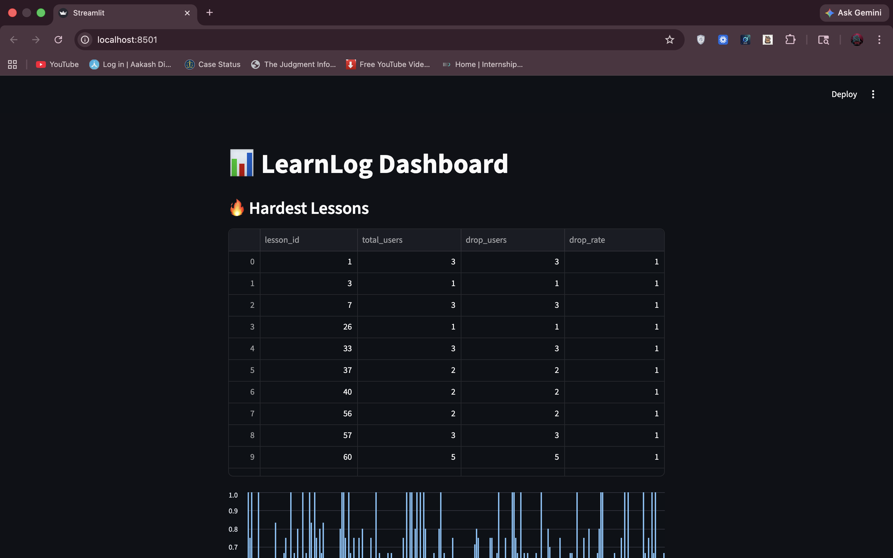
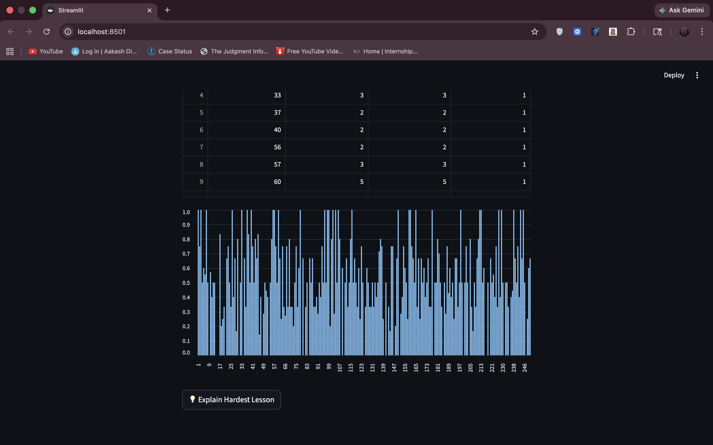
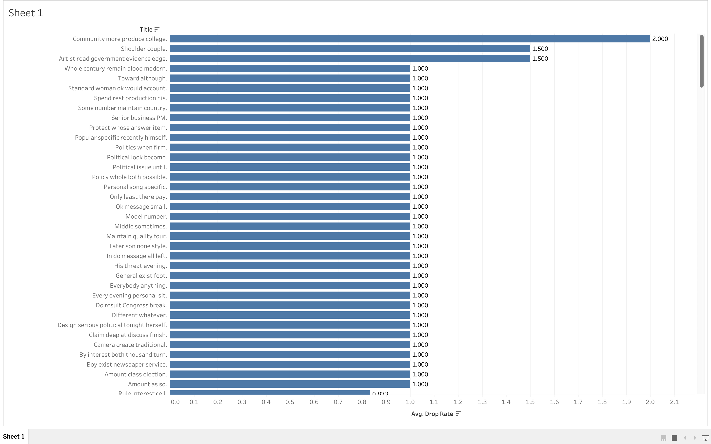

# <div align="center"> LearnLog: EdTech Engagement Tracker </div>

<div align="center">

### Data Analytics Project for User Engagement & Drop-off Analysis

</div>

---

##  Overview

**LearnLog** is a data analytics project that tracks user engagement on an EdTech platform and identifies lessons where students drop off early.
It helps understand **learning behavior patterns** and highlights weak content areas that need improvement.

---

## 🛠️ Tech Stack

- 🗄️ MySQL (Database)
- 🐍 Python (Data Generation & Processing)
- 🧠 SQL (CTEs, Aggregations, CASE Statements)
- 📊 Streamlit (Interactive Dashboard)

---

## Key Features

- 🎯 Tracks user actions (play, pause, complete)
- 📉 Identifies lessons with high drop-off rates
- 🧠 Detects hardest lessons using SQL analysis
- 📊 Interactive Streamlit dashboard
- 💡 Generates business insights from user behavior

---

## Key SQL Concepts Used

- Common Table Expressions (CTEs)
- Aggregations (COUNT, AVG, etc.)
- CASE statements for categorization
- Behavioral analytics queries

---

## 💡 Business Insight

Lessons with high drop-off rates indicate weak engagement or difficulty in content delivery.

Improving these lessons can:
- 📈 Increase course completion rate  
- 😊 Improve user satisfaction  
- 💰 Boost platform revenue  

---

## 📷 Dashboard Preview



## Charts Preview



## Insights


---

## 📊 Tableau Visualization Preview



---

## ▶️ How to Run

```bash
pip install -r requirements.txt
streamlit run app.py
